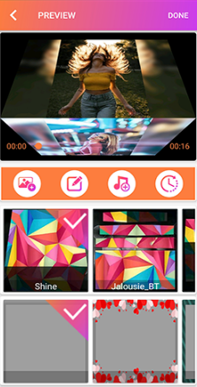
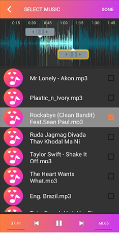

# PhotoEditor-Android

Photo Slideshow with Music app helps you to create fast and awesome slideshow with selected photos and music. For creating videos or slideshow from this application you can just select photos form gallery or captured photos from camera, add music track and select stunning animations. Movie Maker is application for creating video from Images and Music. It’s totally free and be forever. Video Slideshow Editor is the easiest way to create, edit and share amazing photo music videos and stories.

## Screenshot

|                Screenshot               |                 Screenshot            |               Screenshot              |
|:---------------------------------------:|:-------------------------------------:|:-------------------------------------:|
|    |      |    |

## Screenshot

|                Screenshot               |                 Screenshot            |               Screenshot              |
|:---------------------------------------:|:-------------------------------------:|:-------------------------------------:|
|    |      |    |
